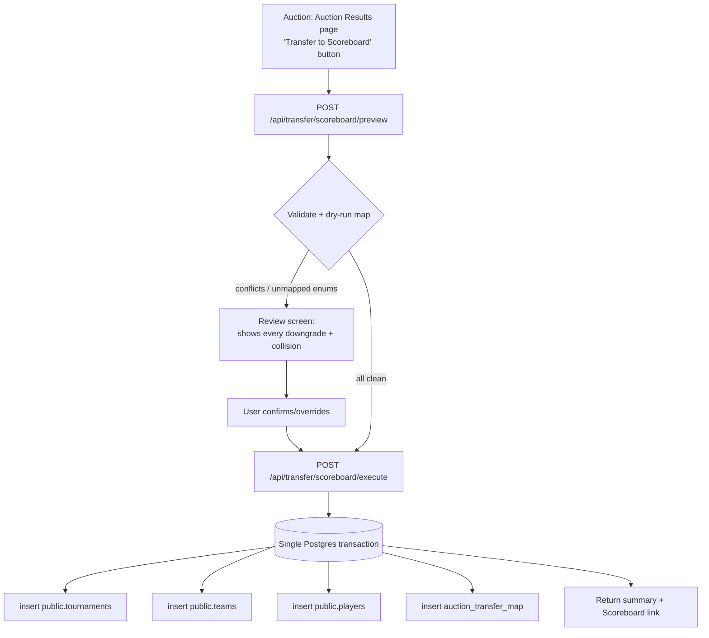

# Auction → Scoreboard Squad Transfer — Implementation Plan

_Drafted 2026-09-09 after code scan of both repos._

Transfer a completed auction's results into the Scoreboard as a ready-to-play
tournament: every team built with its full squad, logos and player headshots.

---

## 1. What the code scan established

These findings shape every decision below. They are facts from the repos, not
assumptions.

| Finding | Evidence | Consequence |
|---|---|---|
| Both apps share **one Neon database** | Identical `DATABASE_URL` host `ep-wild-hat-a16oc9wp-pooler…/neondb` in both `.env` files | No cross-service HTTP call is required for the write. Auction can write Scoreboard tables directly. |
| Both share **one `public.users` table** | `ProStream-Scoreboard/src/lib/db/schema.ts:210` | User identity and ownership already line up. `createdBy` transfers cleanly. |
| Scoreboard owns `public.tournaments/teams/players` | `schema.ts:246,290,309` | This is the write target. |
| Auction data is still in **MongoDB** | `src/models/{Tournament,Team,Player}.ts`; `auction` PG schema unused | The read side is Mongoose, not Drizzle. Do not wait for the Mongo→PG migration. |
| Auction IDs are **strings**, Scoreboard IDs are **serial ints** | `_id: { type: String }` vs `serial('id')` | Need an explicit ID mapping table for idempotency. |
| `cloudinaryUrl()` already **accepts full URLs** and strips them to public_ids | `ProStream-Scoreboard/src/lib/cloudinaryUrl.ts:39-46`, `normalizePublicId():64` | **Images need no re-upload.** This is the single biggest scope reduction. |
| `sportPositions.ts` is already declared shared | `"Single source of truth used by Auction PlayerForm and Scoreboard player UI"` | Position strings map straight across. |

### The one genuinely hard problem: enum mismatch

Scoreboard columns are **hard Postgres enums**. Auction stores **free text**.
A bad value does not degrade, it throws on insert.

```
Auction (free text)              Scoreboard (pg enum, strict)
────────────────────             ──────────────────────────────
'Right-arm Off-spin'      →      bowling_style: 'right-arm-offbreak'
'Leg-spin'                →      bowling_style: 'right-arm-legbreak'
'Left-arm Chinaman'       →      bowling_style: 'left-arm-chinaman'
'Right-arm Medium-fast'   →      bowling_style: ??? (no exact match)
'Wicket Keeper Batsman'   →      player_role: 'keeper'
'Batting All-rounder'     →      player_role: 'allrounder'
```

Note `'Right-arm Medium-fast'` has **no exact target**. Every unmapped value
needs a defined fallback, and the transfer must report what it downgraded
rather than silently guessing.

Other schema traps:
- `teams.shortCode` is `char(3)`; Auction's `TeamForm` allows `maxLength={6}`.
  Truncation must be deterministic and collision-checked within a tournament.
- `players.displayName` is `NOT NULL`; Auction has no such field.
- `teams.primaryColor` is `NOT NULL default '#4F46E5'`; Auction has no team colour.
- Scoreboard has no per-team budget/price concept. Auction's `finalPrice`,
  `initialBudget` and `currentBalance` have nowhere to go in the current schema.

---

## 2. Scope decision

**Transfer:** tournament shell, teams (name, shortCode, logo), squads (sold
players with photos, position, batting/bowling style).

**Do not transfer initially:** auction economics (`finalPrice`, budgets),
unsold players, team officials. Officials have no Scoreboard column; adding one
is a schema change and belongs in a later phase.

**Decide before building — the two questions that change the design:**

1. **Should transferred players link to `player_directory`?**
   The directory is the dedupe/identity backbone (`publicCode`, phone→user
   link). Linking makes a player's history follow them across tournaments;
   skipping it makes every transfer create fresh orphan rows. I recommend
   linking by phone/name later, but **Phase 1 should set
   `directoryPlayerId = null`** and stay ad-hoc, which the schema explicitly
   allows.

2. **Re-transfer semantics.** My recommendation: idempotent upsert keyed on the
   mapping table, so re-running after fixing a typo updates rather than
   duplicates.

---

## 3. Architecture

Because the database is shared, the natural design is a **direct Drizzle write
from the Auction app**. No new service, no HTTP hop, no auth handshake, and the
whole squad lands in one transaction.



The preview step is the core of the design. Enum downgrades and shortCode
collisions must be **visible before** anything is written, not discovered
afterwards in a live scoreboard.

---

## 4. Phases

### Phase 0 — Confirm the contract (before any code)
- Confirm production Auction and Scoreboard point at the same Neon instance
  (verified locally; must be verified for prod env).
- Lock answers to the two decisions in §2.
- Confirm `cloudinaryUrl()` resolves a real Auction photo URL end-to-end.
  This validates the no-re-upload assumption with evidence.

### Phase 1 — Mapping layer (pure, fully testable)
`src/lib/transfer/scoreboardMapping.ts`, no I/O:
- `mapBowlingStyle`, `mapBattingStyle`, `mapPlayerRole` — each returns
  `{ value, exact: boolean, note?: string }` so downgrades are reportable.
- `deriveShortCode(name, taken)` — 3 chars, deterministic, collision-resolved.
- `deriveDisplayName(fullName)`.
- `normalizePhotoRef(url)` reusing Scoreboard's `normalizePublicId`.

This is where the real risk lives, and it is 100% unit-testable with no
database. Table-driven tests over every value in Auction's `BOWLING_STYLES`,
`SPORT_POSITIONS.cricket`, plus null/empty/garbage input.

### Phase 2 — Idempotency mapping table
New table in the `auction` schema (already the designated namespace for
Auction-owned PG data, so it does not pollute `public`):

```
auction.scoreboard_transfer
  auction_tournament_id  text     -- Mongo _id
  scoreboard_tournament_id integer
  auction_entity_id      text     -- team/player Mongo _id
  scoreboard_entity_id   integer
  entity_type            text     -- 'tournament' | 'team' | 'player'
  transferred_at         timestamptz
  unique (auction_entity_id, entity_type)
```

Enables safe re-runs, an accurate "already transferred" badge, and a precise
undo. Needs a Drizzle migration.

### Phase 3 — Preview endpoint (read-only)
`POST /api/transfer/scoreboard/preview` returns:
- teams with resolved shortCodes and any collisions
- per-player mapped role/batting/bowling with an `exact` flag
- **explicit list of every non-exact mapping** (e.g. `'Right-arm Medium-fast' → 'right-arm-medium' (approximate)`)
- players skipped and why (unsold, missing name)
- whether this auction was already transferred

Read-only, so it is safe to iterate against real data.

### Phase 4 — Execute endpoint (transactional)
`POST /api/transfer/scoreboard/execute`:
- authorize: Auction tournament owner/admin **and** Scoreboard admin rights
- guard: auction actually complete; refuse a half-finished auction
- one transaction: tournament → teams → players → mapping rows
- re-run: update existing rows via the mapping table instead of inserting
- return summary + deep link to the Scoreboard tournament

### Phase 5 — UI
Button on `/manage/auction-results`, gated on a completed auction:
preview modal (teams, squad counts, highlighted downgrades) → confirm →
result panel with the Scoreboard link. Shows "Already transferred" with a
re-sync option when the mapping table has rows.

### Phase 6 — Validation
- Unit: full mapping table, including every documented Auction style string.
- Integration: seed a small auction against a scratch Postgres schema, transfer,
  assert row counts, FKs, enum validity, and image URL resolution.
- Idempotency: run twice, assert no duplicates.
- Manual: transfer a real completed auction to a **staging** tournament and open
  it in the Scoreboard UI to confirm logos and headshots actually render.

---

## 5. Risks

| Risk | Severity | Mitigation |
|---|---|---|
| Enum insert failure aborts transfer | High | Total mapping with fallbacks; preview surfaces every downgrade; never pass raw text to an enum column |
| Writing to prod Scoreboard by accident | High | Explicit confirm step; env assertion; staging tournament first |
| Partial write leaves orphan teams | High | Single transaction; nothing is committed unless the whole squad lands |
| shortCode collision within a tournament | Medium | Deterministic derivation + collision resolution, shown in preview |
| Duplicate rows on re-run | Medium | Mapping table keyed on Auction entity ID |
| Auction economics silently lost | Low | Documented as out of scope; add columns later if wanted |

## 6. Effort

| Phase | Estimate |
|---|---|
| 0 Contract confirmation | 0.5 day |
| 1 Mapping + tests | 1 day |
| 2 Mapping table + migration | 0.5 day |
| 3 Preview endpoint | 1 day |
| 4 Execute endpoint | 1–1.5 days |
| 5 UI | 1 day |
| 6 Validation | 1 day |
| **Total** | **~6 days** |

Phases 1–2 are safe to build immediately: pure logic plus an additive migration,
with no risk to live data.

---

## 7. Open questions

1. Link transferred players to `player_directory`, or keep ad-hoc? (Phase 1
   recommendation: ad-hoc.)
2. Should the Scoreboard tournament be created fresh, or should the user pick an
   existing one to populate?
3. Cricket-only for now, or must football/other sports transfer too? Scoreboard
   enums are cricket-shaped, so other sports need a different mapping path.
4. Do team officials (Owner/Manager/Captain) need to reach the Scoreboard? That
   requires a schema addition.
5. Should unsold players transfer as a free-agent pool, or be dropped?

---

## 8. Implementation status (2026-09-09)

Built and verified. Decisions locked with the product owner: fresh Scoreboard
tournament each time, no `player_directory` linking, cricket only, no team
officials, unsold players dropped.

| Piece | File |
|---|---|
| Enum/shortCode/name/image mapping | `src/lib/transfer/scoreboardMapping.ts` |
| Transfer planner (pure) | `src/lib/transfer/scoreboardTransferPlan.ts` |
| Transactional writer + idempotency | `src/lib/transfer/scoreboardTransferService.ts` |
| Schema handles | `src/lib/pg/transfer-schema.ts` |
| Mapping table migration | `drizzle/auction/0002_scoreboard_transfer.sql` |
| Preview API (read-only) | `src/app/api/transfer/scoreboard/preview/route.ts` |
| Execute API (transactional) | `src/app/api/transfer/scoreboard/execute/route.ts` |
| UI | `src/components/TransferToScoreboardButton.tsx` |

### Verification

| Check | Result |
|---|---|
| `npm run test:scoreboard-mapping` | 47 assertions, every real Auction vocabulary value |
| `npm run test:scoreboard-plan` | 18 assertions |
| `npm run test:scoreboard-transfer-db` | 14 assertions against the live DB in a rolled-back transaction |
| Real production data | Horana Premier League: 14 teams, 175 players, 175/175 photos, 0 invalid enums; football league correctly blocked |
| `npm run build` | passes |
| API auth | unauthenticated request returns 401, missing id returns 400 |

### Corrections found during implementation

1. **Live enums differ from a naive reading of the Scoreboard source.**
   `tournament_status` is `upcoming/group_stage/knockout/complete` (no `active`
   or `completed`) and `tournament_model` is only `league/knockout`. Introspecting
   the real database prevented a runtime failure.
2. **The `auction` schema does not exist in the live database.** The existing
   `drizzle/auction` migrations describe the unapplied Mongo→Postgres migration,
   so the mapping table had to be standalone and idempotent, and is also created
   on demand inside the transaction.
3. **Misleading warning.** A short code that was both truncated and then collided
   reported only the collision, hiding the truncation from the operator.

### Deliberately still out of scope

Auction economics (`finalPrice`, budgets) have no Scoreboard column. Adding them
means a schema change in the Scoreboard repo.

---

## 9. Scope narrowed (2026-09-10)

Per the operator: transfer **player name, primary photo, position and team
membership only**. Nothing else, and no Scoreboard schema change.

Terminology: what the Auction calls **position** is what the Scoreboard calls
**role**. The transfer maps Auction `position` onto the Scoreboard's `role`
enum, and also keeps the original text in the Scoreboard's own nullable
`position` column.

Removed from the transfer:

- `batting_style` and `bowling_style` are no longer written. Both columns are
  nullable, so they are simply omitted and Postgres applies its own defaults
  (`right-hand` / `NULL`). `mapBattingStyle` and `mapBowlingStyle` were deleted.

Effect on real data (Horana Premier League, 175 players): adjustment warnings
fell from **27 to 1**, because nearly all of them were "no batting style set"
notices for a field that is no longer transferred. Photo retention stays
175/175 and invalid role count stays 0.

Per-player payload is now exactly:
`auctionPlayerId, name, displayName, role, position, headshotCloudinaryId`
(asserted by a test, so the payload cannot silently grow again).
