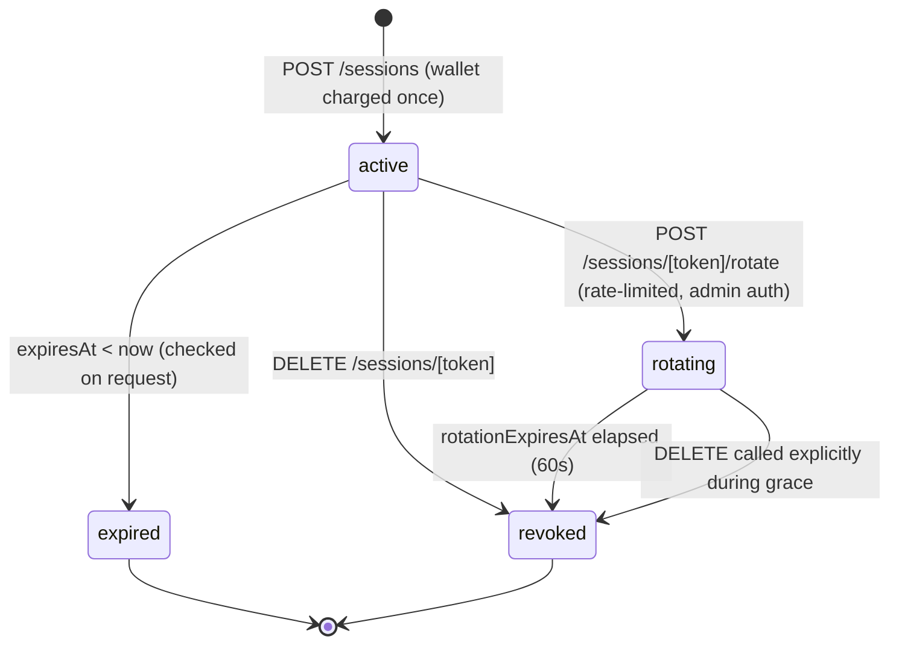

# Overlay Token Rotation Design

Status: Future hardening design. Persistent `OverlaySession` tokens, paid session creation, revocation, and active-session enforcement are implemented today. Full short-lived rotation is not the current production model.

Current implemented model is documented in [`docs/prostream-ecosystem.md`](./prostream-ecosystem.md):

- `OverlaySession._id` is the persistent OBS token.
- Sessions are created by `POST /api/overlay/sessions` and may charge wallet balance.
- Sessions are revoked by marking `isActive=false` and broadcasting overlay revoke events.
- Theme/palette may be passed in generated URLs as source-specific overrides.

This design remains the canonical future plan for moving overlay session tokens from
long-lived opaque DB bearers to short-lived, rotatable, scope-bound
tokens. It is the consolidated output of an Architecture pass
(Sonnet 4.6) and a Final QA / Review pass (Opus 4.7); the Opus pass
identified and fixed three blockers in the original Sonnet plan.
The raw drafts are preserved alongside this doc for traceability:

- `docs/overlay-token-rotation.sonnet-draft.md`
- `docs/overlay-token-rotation.opus-review.md`

---

## 1. Threat Model

- **OBS scene-collection leak.** OBS exports share the full overlay
  URL including `?token=`, exposing a permanent bearer to anyone who
  receives the collection.
- **Token replay after revoke.** Without expiry, a revoked token is
  only invalidated as fast as the DELETE + Pusher event; a flaky
  network leaves the token alive.
- **Scope escalation.** A token issued for one overlay type could be
  replayed against another if scope binding is loose.
- **Unbounded theme/palette injection.** Free-form `?theme=` and
  `?palette=` flow into `effectiveTournament` overrides; arbitrary
  values reach the React tree.
- **Rotation-window harvest.** An attacker who holds the
  about-to-expire token must not be able to discover the successor
  token through any channel that token can reach.
- **Legacy shared-secret bypass.** `OVERLAY_SECRET_TOKEN` is still
  accepted by `/api/tournaments/active`; if that env leaks, every
  tournament is exposed regardless of session controls. This must
  be neutralized in the same release that ships rotation.

## 2. Decision Table

| Requirement              | Decision |
| ---                      | --- |
| Expiry                   | 30-day TTL stored in DB (`expiresAt`). Opaque UUIDv4 tokens, no JWT. |
| Rotation grace           | 60s grace window. Both old + new tokens valid for 60s after `POST /rotate`. Then old token returns 401. |
| Successor delivery       | Successor token id is returned **only** in the HTTP response of `POST /rotate` to the authenticated admin. It is never delivered via Pusher, never returned by `/status`, never logged in plaintext. |
| Scope binding            | `(tournamentId, overlayType)` is bound at the DB row and enforced on every request. |
| Theme / palette          | Strict allowlist defined alongside `validateOverlaySessionToken`. Ships in observe-only mode for one release (log violations, do not reject), then enforced. |
| Legacy `OVERLAY_SECRET_TOKEN` | Gated behind `LEGACY_OVERLAY_SECRET_ENABLED` env flag (default `false` in prod) in this release. Code path deleted in the follow-up PR. |
| Backward compatibility   | Force-migrate. Existing sessions get `expiresAt = max(createdAt + 30d, now + 7d)`. Sessions whose 30d window already elapsed at migration time emit an admin notification per affected tournament; the 7-day grace is never silent. |
| Rotation cost            | Free. The one-time wallet charge at session creation is preserved; rotation does not deduct. |
| Rate limit               | Minimum 60s between rotations per `(tournamentId, overlayType)`. Maximum chain depth 10 within 24h. |
| Token format             | Opaque DB id (UUIDv4). No signed tokens, no key management. Revocation is the dominant requirement and signed tokens cannot be revoked without a blocklist that negates the DB-skip benefit. |
| Expiry warning channel   | Admin Pusher channel `private-admin-tournament-<id>`. Never broadcast on the public overlay channel. |

## 3. Token Lifecycle

Notes:

- The successor of a rotating token is a **new** `active` session row.
  Its `_id` (the new token) is delivered **only** in the HTTP response
  to the admin who called `/rotate`. Any code path that returns a
  successor id to anyone holding the predecessor token is a bug.
- `overlay:expiring` fires on the admin channel 24h before
  `expiresAt`. It carries no token material.
- `overlay:rotating` may fire on the public overlay channel to tell
  the live overlay to keep rendering stale data for the grace window,
  but it carries only `{ state: "rotating", gracePeriodSec }`; never
  the successor token.

## 4. API Surface

| Method | Route                                          | Purpose |
| ---    | ---                                            | --- |
| POST   | `/api/overlay/sessions`                        | Create session. Wallet charge happens here. Unchanged. |
| GET    | `/api/overlay/sessions`                        | Admin list. Unchanged. |
| DELETE | `/api/overlay/sessions/[token]`                | Immediate revoke. Unchanged. |
| POST   | `/api/overlay/sessions/[token]/rotate`         | Admin-auth required. Rate-limited. Creates successor session and returns `{ newToken, newUrl, gracePeriodSec }` **only in this HTTP response**. |
| GET    | `/api/overlay/sessions/[token]/status`         | Returns `{ state, expiresAt }`. Never returns `successorTokenId`. |
| POST   | `/api/overlay/sessions/migrate`                | Internal admin. Idempotent backfill of `expiresAt`. |

## 5. Mongo Schema Additions

All additive. None of these fields are required to exist on legacy rows
prior to migration; the validation middleware treats `expiresAt = null`
as "not yet enforced" while `OVERLAY_EXPIRY_ENFORCED=false`.

| Field                | Type             | Meaning |
| ---                  | ---              | --- |
| `expiresAt`          | `Date`           | Hard expiry. Requests reject if `expiresAt < now` (when enforcement is on). |
| `rotationExpiresAt`  | `Date \| null`   | Grace deadline. While set and in the future, the token is in `rotating` state. |
| `successorTokenId`   | `String \| null` | Server-side audit only. Never serialized to any client response. |
| `predecessorTokenId` | `String \| null` | Audit back-reference. |
| `themeSnapshot`      | `Object \| null` | Optional audit: theme/palette/debug values at issue time. Not enforced. |
| `rotationCount24h`   | `Number`         | Rolling counter to enforce max chain depth. |

Indexes to add:

- `{ expiresAt: 1 }` (plain index, **no TTL** — TTL would auto-purge
  rows and break the predecessor/successor audit chain).
- `{ tournamentId: 1, overlayType: 1, isActive: 1 }` (already exists).

## 6. Client / UX Changes

- **`src/app/manage/overlays/sessions/page.tsx`**
  - Add a "Rotate" button per active session.
  - Show an expiry badge (yellow `< 5 days`, red `< 1 day`).
  - On rotate success, show a modal with the new URL and a copy-to-clipboard button. Display the grace window so the admin knows their existing OBS source will keep working for 60s.
- **`src/hooks/usePusherAuction.ts`**
  - On `overlay:rotating`, keep rendering stale data for up to 60s. Do **not** attempt to fetch the new token from the public channel. If the overlay is still mounted after grace, surface an admin-only "session rotated" state and stop rendering.
  - On `overlay:revoke`, unchanged.
- **Admin dashboard** (wherever admin Pusher subscriptions live)
  - Subscribe to `private-admin-tournament-<id>` for `overlay:expiring` (24h pre-warning) and `overlay:rotated` notifications. Toasts and badges live here, not on the public overlay channel.
- **`src/lib/overlay-auth.ts`**
  - `validateOverlaySessionToken` adds:
    1. Expiry check (`expiresAt < now → fail`), gated by `OVERLAY_EXPIRY_ENFORCED`.
    2. Grace-window acceptance (`rotationExpiresAt > now → pass`).
    3. Theme/palette allowlist validation in observe-only mode (log violation metric, do not 400) initially. Enforcement is flipped on after one release.
- **`src/components/overlays/OverlayWrapper.tsx` and `TeamOwnerOverlay.tsx`**
  - Validate `theme` and `palette` URL params against the same allowlist. Unknown values silently fall back to tournament defaults; do not propagate raw strings into `effectiveTournament` overrides.

## 7. Migration Plan

1. Ship schema fields + middleware behind feature flag `OVERLAY_EXPIRY_ENFORCED=false`; allowlist in observe-only mode.
2. Run `scripts/migrateOverlaySessions.ts`: backfill `expiresAt = max(createdAt + 30d, now + 7d)`. For each row where `createdAt + 30d < now` at migration time, emit an admin notification listing the affected tournament. Script is idempotent and safe to re-run.
3. Verify `db.overlaysessions.countDocuments({ expiresAt: null }) === 0`.
4. Review one week of allowlist-violation logs and expand the allowlist to cover legitimate themes that surfaced.
5. Flip `OVERLAY_EXPIRY_ENFORCED=true` and enable allowlist enforcement.
6. Set `LEGACY_OVERLAY_SECRET_ENABLED=false` in prod, closing the shared-secret bypass.
7. Follow-up PR: delete the legacy `OVERLAY_SECRET_TOKEN` code path entirely from `/api/tournaments/active`.

## 8. Open Questions (deferred)

1. **Email-on-rotate.** Admin dashboard is the canonical surface for v1. If streamers report missing rotations because they were live and away from the dashboard, add an email path in a follow-up.
2. **Per-`overlayType` allowlist vs global.** Ship a global allowlist for v1; revisit if observe-only logs show legitimate themes blocked by overlay type.
3. **Renewal beyond 30 days.** Default for v1: free rotate, no new wallet charge. Revisit if abuse appears or product wants a paid renewal model.

---

## Implementation Order

1. Add schema fields (`expiresAt`, `rotationExpiresAt`, `successorTokenId`, `predecessorTokenId`, `themeSnapshot`, `rotationCount24h`) and the plain (non-TTL) `expiresAt` index.
2. Update `validateOverlaySessionToken` to add expiry check, grace-window acceptance, and theme/palette allowlist in observe-only mode, all behind the `OVERLAY_EXPIRY_ENFORCED` flag.
3. Implement `POST /api/overlay/sessions/[token]/rotate` with admin auth, the rate limit (60s minimum + max-chain-depth 10/24h), and the response containing the new token; harden `GET /[token]/status` to never include the successor id.
4. Gate the legacy `OVERLAY_SECRET_TOKEN` path in `/api/tournaments/active` behind `LEGACY_OVERLAY_SECRET_ENABLED` (default `false` in prod).
5. Wire the admin Pusher channel for `overlay:expiring` (24h pre-warning) and `overlay:rotated`; ensure no token material appears in public overlay Pusher payloads.
6. Build the manage-page rotate UI: button per session, expiry badge, post-rotate modal showing the new URL.
7. Write and run the idempotent migration script; emit admin notifications for sessions whose 30-day window already elapsed.
8. After one week of observe-only allowlist logs, expand the allowlist to cover legitimate themes, flip `OVERLAY_EXPIRY_ENFORCED=true`, and confirm `LEGACY_OVERLAY_SECRET_ENABLED=false` is set in prod.
9. Follow-up PR: delete the legacy secret code path.

## Verifiable Acceptance Criteria

- **Token containment.** Rotate a session in an automated test and assert that the HTTP response body for `GET /status` on the old token, and every Pusher event emitted on the public overlay channel during the grace window, contain no field whose value equals the new token.
- **Grace-window correctness.** Integration test with a fake clock: immediately after `POST /rotate`, both old and new tokens authenticate successfully; at `t = 61s`, the old token returns 401 and the new token still works.
- **Rate limit.** Two consecutive `POST /rotate` calls within 60s on the same `(tournamentId, overlayType)` return 429 on the second call.
- **Legacy bypass closed.** With `LEGACY_OVERLAY_SECRET_ENABLED=false`, requests to `/api/tournaments/active` carrying a valid `OVERLAY_SECRET_TOKEN` return 401.
- **Migration completeness.** Post-migration, `db.overlaysessions.countDocuments({ expiresAt: null }) === 0` and the admin notification log contains exactly one entry per session whose `createdAt + 30d < migrationRunTime`.
- **Allowlist observability.** Observe-only mode emits a structured log entry / metric for each rejected `theme` or `palette` value without returning 400, and the metric is queryable across the one-week review window.

---

## Provenance

This plan was produced by a multi-agent flow:

- Audit: main agent (GPT-5.5) inspected `OverlaySession`, `overlay-auth.ts`, `sessions/route.ts`, `sessions/[token]/route.ts`, `tournaments/active/route.ts`.
- Architecture draft: Claude Sonnet 4.6 (via `jcode run -p claude -m claude-sonnet-4-6`), session id recorded in `swarm_runs/arch_sonnet.json`.
- QA / Review: Claude Opus 4.7 (via `jcode run -p claude -m claude-opus-4-7`), session id recorded in `swarm_runs/opus_review.json`. The Opus pass found 3 BLOCKER defects, 4 MAJOR defects, and 1 MINOR defect in the Sonnet draft, all of which are folded into this consolidated plan.
