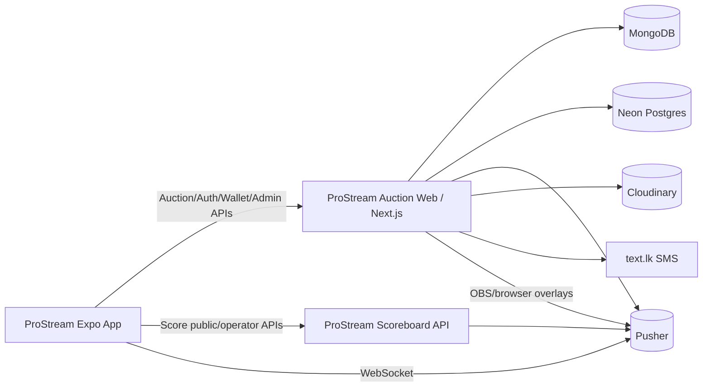
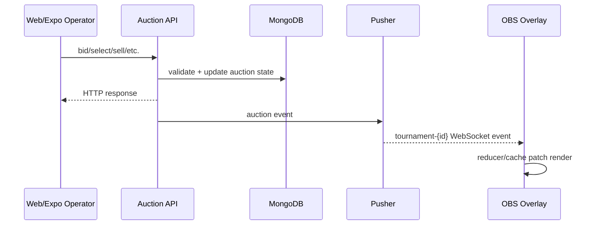

# ProStream Ecosystem — Current Architecture

_Last updated after code scan: 2026-06-20_

This document is the source-of-truth map for the current ProStream ecosystem across:

- `ProStream---Auction` — Next.js web app and auction API backend
- `ProStream-Expo-App` — Expo mobile operator/management app
- External Scoreboard backend — used by the Expo Score module

## 1. System overview



## 2. Web auction app

Repository: `ProStream---Auction`

### Stack

- Next.js 15 App Router
- React 19
- TypeScript
- MongoDB/Mongoose
- Neon Postgres/Drizzle
- Pusher
- Cloudinary
- Expo Server SDK for push notifications
- PDF/invoice/report generation modules

### Main app areas

| Area | Paths | Purpose |
|---|---|---|
| Auth | `/auth/*`, `/api/auth/*` | Login, signup, session restore, OTP |
| Auction management | `/manage/*`, `/auction/*` | Tournament, team, player, auction control |
| Overlay outputs | `/overlays/:id/*`, `/output` | OBS/browser-source outputs and output generation |
| Wallet | `/wallet`, `/api/wallet/*` | Shared user wallet and transactions |
| Users/Admin | `/users`, `/api/users/*`, `/api/admin/*` | User management, access, notifications, overlay pricing |
| InvoiceIt | `/invoiceit/*`, `/api/invoices/*`, `/api/quotations/*`, `/api/customers/*` | Invoices, quotations, customers, PDFs |
| Upload/media | `/api/upload`, `/api/remove-background` | Cloudinary-backed media management |

## 3. Storage boundaries

| Store | Ownership |
|---|---|
| MongoDB/Mongoose | Tournaments, teams, players, auction state, overlay sessions/config/library/scenes, invoices, quotations, customers |
| Neon Postgres | Users, user tournament assignments, wallets, wallet transactions, pricing config, push tokens, phone OTP verifications |
| Cloudinary | Logos, player photos, team images, tournament/wheel assets, uploads |
| Pusher | Realtime auction and overlay events |

## 4. Auction domain

### Core Mongo models

- `src/models/Tournament.ts`
- `src/models/Team.ts`
- `src/models/Player.ts`
- `src/models/AuctionState.ts`
- `src/models/OverlaySession.ts`

### Important tournament features

`Tournament` now includes:

- `overlayTheme`: `standard | premium | neon | theme2 | theme3`
- `overlayPalette`
- `overlayControlSettings`
- `biddingMode`: `direct | team`
- player classes and per-class pricing
- bid increment/slab settings
- player card/template/profile field settings
- auction date and branding fields

### Hot auction APIs

| Endpoint | Purpose |
|---|---|
| `GET /api/auction/bootstrap?tournamentId=...` | Single-call tournament/state/players/teams bootstrap |
| `GET /api/auction/live?tournamentId=...` | Mobile live auction bootstrap |
| `POST /api/auction/start` | Start auction and reset state |
| `POST /api/auction/select-class` | Activate/clear class filter |
| `POST /api/auction/select-player` | Select current player |
| `POST /api/auction/bid` | Place direct/team bid |
| `POST /api/auction/bid/correct` | Correct current bid downward/upward |
| `POST /api/auction/sell` | Finalize sale |
| `POST /api/auction/mark-unsold` | Mark current player unsold |
| `POST /api/auction/undo` | Undo last sold/unsold action |
| `POST /api/auction/re-auction` | Move unsold players back to available |
| `POST /api/auction/edit-player-result` | Edit a sold/unsold/available result |

## 5. Realtime auction and overlay pipeline



Current latency optimizations:

- `POST /api/auction/bid` performs parallel DB reads and atomic state update.
- Bid updates use `currentBid: { $lt: amount }` to reject superseded bids with `409`.
- Pusher bid triggers are fire-and-forget so the operator response does not wait on Pusher REST RTT.
- Bid payloads avoid team DB reads and rely on already-loaded client team data.
- Pusher server helper trims large history arrays.
- `usePusherAuction` uses `/api/auction/bootstrap` instead of 4 separate startup requests.
- Overlay bootstrap requests are deduped during mount/token-hydration/reconnect.
- Mongoose deprecated `{ new: true }` options have been replaced with `returnDocument: 'after'`.

## 6. Overlay system

### Output routes

| Overlay type | Path | Pricing key |
|---|---|---|
| `fullscreen` | `/overlays/:id` | `auction_overlay_fullscreen` |
| `fullscreen2` | `/overlays/:id/fullscreen2` | `auction_overlay_fullscreen2` |
| `custom` | `/overlays/:id/custom` | `auction_overlay_custom` |
| `team_owners` | `/overlays/:id/team-owner` | `auction_overlay_team_owners` |

Overlay URLs may include:

```text
token=<overlay-session-token>
theme=theme1|theme2|theme3
palette=default|midnight|ember|neon
```

Theme and palette URL params override tournament defaults for that browser source only.

### Paid overlay sessions

Overlay output creation is wallet-backed:

1. User requests an overlay output via `/api/overlay/sessions`.
2. Server checks tournament access.
3. Server reads overlay price from Neon pricing config with fallback defaults.
4. Server deducts wallet balance if price > 0.
5. Server creates `OverlaySession` in MongoDB.
6. If session creation fails after deduction, server attempts an automatic refund.

`OverlaySession._id` is the persistent OBS token. Revocation sets `isActive=false` and is enforced by overlay auth.

### Overlay control settings

Runtime controls are persisted under `Tournament.overlayControlSettings` and broadcast through `overlay:settings` Pusher events. Controls include:

- display mode
- large/small player card size
- ticker mode
- custom ticker lines
- team-wise selected team
- team card visibility/size/position
- bid card position
- sold message position
- ticker visibility per output

## 7. Theme system

Theme routing is centralized in `src/lib/overlays/resolveOverlayThemeContent.tsx`.

| Theme | Component family | Notes |
|---|---|---|
| Theme 1 | `src/components/overlays/theme1/*` plus legacy overlay components | Classic/default output |
| Theme 2 | `src/components/overlays/theme2/*` | Uses `--t2-*` CSS variable namespace |
| Theme 3 | `src/components/overlays/theme3/*` | New broadcast system with dedicated layouts and tokens |

Theme3 includes:

- Full Screen primary player card
- Full Screen 2 secondary-image/bid-card layout
- Custom lower-third/portrait player card
- Wheel Spin
- Resting Time lower-third
- Sold Players Summary
- Top 10 Summary
- Team Summary
- Team Wise Summary
- Team Imagery lineup
- Ticker head rotator and shared ticker system

Palettes live in `src/config/overlayPalettes.ts` and define token contracts, especially `--t3-*` and `--t3-bar-*` for Theme3.

## 8. Expo mobile app

Repository: `ProStream-Expo-App`

### Stack

- Expo SDK 56
- Expo Router
- React Native 0.85
- React 19
- TanStack Query
- Zustand
- Pusher JS
- Expo Secure Store
- Expo SQLite
- Expo Notifications

### Main route groups

| Route group | Purpose |
|---|---|
| `app/(auth)` | Login and request-access/OTP flow |
| `app/(app)/(tabs)` | Home, Score, Auction, Wallet, Profile |
| `app/(app)/auction/[tournamentId]` | Mobile auction panel, overlay controls, players, teams |
| `app/(app)/tournaments/[tournamentId]/edit` | Tournament setup/edit/teams/players/overlays |
| `app/(app)/tournaments/[tournamentId]/view` | Auction results |
| `app/(app)/admin` | Admin hub, user creation, tournament access |
| `app/(app)/score` | Score tournaments, matches, standings, operator scoring |

### Expo auction integration

- Uses Auction web backend via `EXPO_PUBLIC_API_BASE_URL`.
- `hooks/useAuction.ts` uses TanStack Query for auction data/mutations.
- `hooks/usePusherAuction.ts` patches React Query cache from Pusher events.
- Bids are optimistic in the app and reconciled with server state.
- Auction Overlay screen can now generate Theme1/Theme2/Theme3 output URLs with palette and output-type selection.

### Expo score integration

Score module talks to a separate Scoreboard backend:

- default: `https://prostream-scoreboard.vercel.app`
- env: `EXPO_PUBLIC_SCORE_API_BASE_URL`

Score operator flow uses local SQLite buffering and flushes deliveries to the scoreboard backend while sending overlay updates quickly through Pusher.

## 9. Score module

The score module is in Expo, not the Auction Next.js repo.

Important files:

- `ProStream-Expo-App/hooks/useScore.ts`
- `ProStream-Expo-App/lib/scoreApi.ts`
- `ProStream-Expo-App/lib/scoreOperatorApi.ts`
- `ProStream-Expo-App/lib/scoreLocalDb.ts`
- `ProStream-Expo-App/lib/scoreFlush.ts`
- `ProStream-Expo-App/lib/scorePusher.ts`
- `ProStream-Expo-App/types/score.ts`

Current model:

- Public score/tournament pages use the scoreboard API.
- Operator scoring writes pending deliveries to local SQLite first.
- Pending deliveries are flushed at over-end/background/innings-end.
- Overlay updates are sent immediately through the scoreboard backend Pusher trigger route.

## 10. Auth, roles, wallet and pricing

### Roles

Current primary roles:

- `Admin`
- `Tournament`
- `Player`
- `Audience`

Auctioneer/operator permissions are role-gated. Admin has broad access. Tournament users are restricted by ownership/assignment where required.

### OTP and phone verification

Phone OTP uses shared helpers from `@prostream/shared` and stores verification records in Neon Postgres.

Important constants:

- OTP expiry: 10 minutes
- Cooldown: 60 seconds
- Max attempts: 5

### Wallet and pricing

- Wallet currency is LKR.
- Overlay prices are configurable in Neon pricing config.
- Default overlay prices are defined in `src/lib/overlays/overlayPricing.ts`.
- The web `/api/overlay/prices` and session listing price maps are cached in-process for 5 minutes.

## 11. Deployment and environment

### Web app important env

- MongoDB connection string
- Neon `DATABASE_URL`
- Pusher app credentials
- Cloudinary credentials
- JWT/auth secrets
- SMS/text.lk credentials
- Expo push config where applicable

### Expo app important env

- `EXPO_PUBLIC_API_BASE_URL`
- `EXPO_PUBLIC_SCORE_API_BASE_URL`
- `EXPO_PUBLIC_CLOUDINARY_CLOUD_NAME`
- `EXPO_PUBLIC_PUSHER_KEY`
- `EXPO_PUBLIC_PUSHER_CLUSTER`

Expo public env values are bundled at build time, so APKs must be rebuilt after changing them.

## 12. Documentation maintenance rules

When changing ecosystem behavior, update these docs together:

- `ProStream---Auction/docs/architecture.md`
- `ProStream---Auction/docs/overlay-theme-system.md`
- `ProStream---Auction/docs/pusher-direct-overlay-feasibility.md`
- `ProStream---Auction/docs/prostream-ecosystem.md`
- `ProStream-Expo-App/Documentation/API_ROUTES.md`
- `ProStream-Expo-App/Documentation/SCREENS.md`
- `ProStream-Expo-App/Documentation/USER_PROCESS_FLOW.md`
- `ProStream-Expo-App/Documentation/PROSTREAM_ECOSYSTEM.md`
