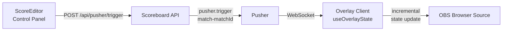
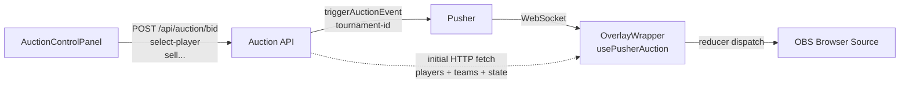

# Feasibility: Direct Auction → Overlay via Pusher (like Score → Overlay)

**Date:** 2026-06-10  
**Verdict:** ✅ Fully Feasible — Foundation Already Exists

---

## How Score → Overlay Works (reference pattern)

- Channel: `match-{matchId}`
- Overlay does **incremental in-memory updates** from Pusher payloads (no HTTP refetch per delivery/wicket)
- Only hard events (`wicket.fell`, `innings.change`, `state.refresh`) trigger an HTTP refetch

---

## How Auction → Overlay Currently Works

- Channel: `tournament-{id}` — **already direct Pusher**
- `usePusherAuction` already uses a `useReducer` to apply events directly (like Score pattern)
- Difference: initial hydration + some recovery paths still use HTTP

---

## Key Finding: Same Pusher App

Both apps share **identical credentials** (`APP_ID: 2072858`, `cluster: ap2`) — meaning they are on the **same Pusher account**, so a Pusher message from the Auction server is inherently receivable by the Scoreboard overlay and vice versa. No credential changes needed.

---

## What's Already Done vs. What's Missing

| Feature | Score→Overlay | Auction→Overlay Today | Gap |
|---|---|---|---|
| Pusher direct channel | ✅ `match-{id}` | ✅ `tournament-{id}` | None |
| Incremental state updates | ✅ full in-memory | ✅ reducer dispatch | None |
| HTTP-free hot path | ✅ (most events) | ⚠️ initial fetch + recovery fetches remain | Minor |
| Shared Pusher account | ✅ | ✅ same credentials | None |
| Overlay auth / token | Basic session | ✅ token-based for OBS | None |
| `overlay:settings` control | ✅ `display.toggle` | ✅ `overlay:settings` | None |
| Wake/sleep lifecycle | ❌ not needed | ✅ 2-tier channel strategy | None |

---

## The Only Real Gap

`OverlayWrapper` **double-subscribes** to `tournament-{id}` — once inside `usePusherAuction` (for auction events) and once in a separate `useEffect` (for `overlay:settings` / `overlay:wheel-spin`). Minor code smell, not a blocker.

---

## Implementation Plan (when ready)

### Step 1 — Move bindings into `usePusherAuction`
- Move `overlay:settings` and `overlay:wheel-spin` event bindings from `OverlayWrapper`'s standalone `useEffect` into Effect 4 inside `usePusherAuction` (alongside all other auction event handlers)
- Remove the duplicate `pusher.subscribe(tournament-{id})` call in `OverlayWrapper`

### Step 2 — Expose from hook
- Add `overlaySettings: OverlaySettings` and `wheelSpinData: WheelSpinEvent | null` to `UsePusherAuctionReturn`
- Move `DEFAULT_OVERLAY_SETTINGS` into `usePusherAuction` or a shared constants file

### Step 3 — Update `OverlayWrapper`
- Consume `overlaySettings` and `wheelSpinData` directly from the hook return instead of local state
- Remove the now-redundant local `useState` and `useEffect` for those two values

### Files to touch
| File | Change |
|---|---|
| `src/hooks/usePusherAuction.ts` | Add overlay:settings + overlay:wheel-spin bindings in Effect 4; expose from return |
| `src/components/overlays/OverlayWrapper.tsx` | Remove duplicate subscribe useEffect; read from hook |
| `src/lib/overlays/auctionOverlayTypes.ts` | No change needed |

**Estimated effort:** ~1–2 hours, low risk.
