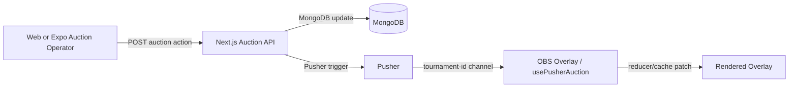

# Auction → Overlay Realtime Architecture

**Status:** Implemented and actively used  
**Last updated:** 2026-06-20

This document supersedes the older feasibility framing. Auction overlays already receive direct Pusher events from the Auction API. HTTP is used for bootstrap/recovery only, not for the live bid hot path.

See also: [`docs/prostream-ecosystem.md`](./prostream-ecosystem.md).

## Current flow



## Channels

| Channel | Used by | Purpose |
|---|---|---|
| `tournament-{tournamentId}` | Auction controls, overlays, Expo | Auction state, bid, sell, undo, class, overlay settings, wheel events |
| `prostream-control` | Overlay lifecycle | Wake/sleep/revoke signals for browser-source sessions |

## Hot-path bid behavior

`POST /api/auction/bid` is optimized for operator-to-overlay latency:

1. Auth user is read via cached `getUserFromRequest`.
2. Auction state and tournament are fetched in parallel.
3. Player lookup and atomic state update run in parallel.
4. State update uses `currentBid: { $lt: amount }` to reject superseded bids with `409`.
5. Pusher bid event is triggered fire-and-forget.
6. HTTP response returns without waiting for the Pusher REST roundtrip.
7. Overlay receives `auction:bid-placed` and patches in-memory state.

## Bootstrap and recovery

Initial overlay load uses:

```text
GET /api/auction/bootstrap?tournamentId=...
```

This returns tournament, auction state, players, and teams in one request. It replaced the previous four-request startup pattern.

`usePusherAuction` now dedupes bootstrap calls during mount/token hydration/reconnect so a single overlay tab does not spam repeated bootstrap requests.

Recovery refreshes are only used when needed:

- WebSocket recovers from a failed/unavailable/disconnected state
- tab visibility returns after the cached state is stale
- explicit user refresh

## Event handling

Main events include:

- `auction:started`
- `auction:stopped`
- `auction:restarted`
- `auction:player-selected`
- `auction:bid-placed`
- `auction:player-sold`
- `auction:player-unsold`
- `auction:undo`
- `auction:reset`
- `auction:state-update`
- `auction:class-selected`
- `auction:class-completed`
- `overlay:settings`
- `overlay:wheel-spin`
- `overlay:revoke`

## Payload rules

Do:

- Send only changed/current entities where possible.
- Keep teams/players cached client-side.
- Use IDs for already-loaded related records.
- Trim large histories before Pusher trigger.

Do not:

- Broadcast the full player/team list for every bid.
- Await Pusher REST calls on the bid hot path.
- Add extra MongoDB team reads to bid events if `winningTeamId` is enough.

## Expo app behavior

`ProStream-Expo-App/hooks/usePusherAuction.ts` patches TanStack Query cache from Pusher events.

- `auction:bid-placed` patches auction state directly.
- `auction:player-selected` patches current player state.
- sell/undo/re-auction lifecycle events invalidate/refetch because roster/team balances may change.

## Remaining acceptable HTTP usage

HTTP fetches still exist for:

- initial bootstrap
- session/token validation
- reconnect recovery
- explicit pull-to-refresh
- management pages that are not live overlay hot path

This is intentional. The live bidding path is Pusher-first.
